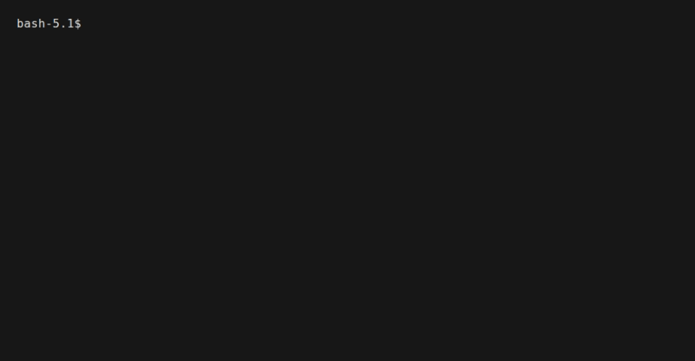
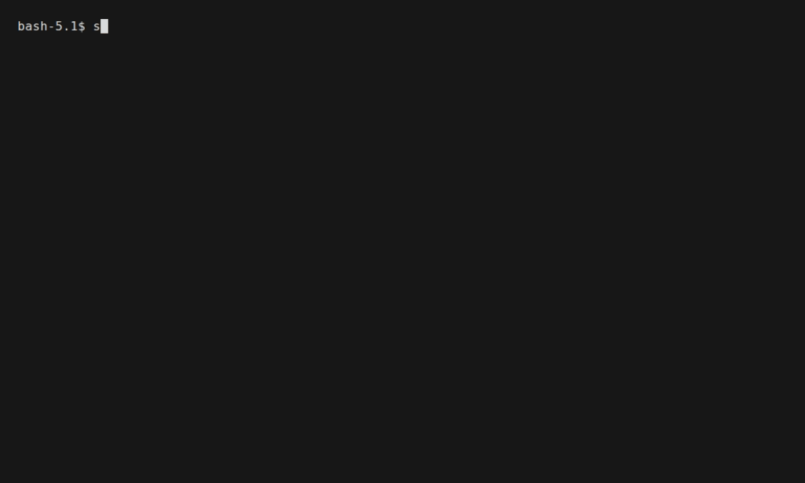

# Teff — Durable AI workflows as data

[](https://github.com/bzdvdn/teff/actions)
[](https://github.com/bzdvdn/teff)
[](https://pypi.org/project/teff/)
[](https://pypi.org/project/teff/)
[](LICENSE)

*Durable AI workflows as data.*

Every agent project has the same arc: one `for` loop of LLM calls feels fine,
a second agent needs branching, a third needs retries and state — and soon
the logic of your product is buried in order-6 loops of `async` code that
nobody can read, nobody can resume, and nobody can debug.

Teff is the other pattern: **the workflow is data**. Branching, retries,
checkpointing and pausing live in the *structure* of a graph, not in the body
of your functions. Run it — and when the process dies, it picks up exactly
where it stopped.

Build stateful AI agents as **YAML or Python graphs** and run them safely in
production:

```text
                 YAML / Python
                       │
                       ▼
                  ┌─────────┐
                  │  Graph  │
                  └────┬────┘
                       │
          ┌────────────┼────────────┐
          ▼            ▼            ▼
         LLM          Tools         RAG
          │            │            │
          └────────────┼────────────┘
                       ▼
                 Checkpoint
                       │
                 crash / pause
                       │
                       ▼
                    Resume
```

Teff is async-first: nodes, tools and LLM calls are `async`, and a run can be
**checkpointed, inspected, paused, resumed and evaluated**. The flow is
**data**, every run is **durable**, and nothing is a black box. Read the whole
story in [**Why Teff**](docs/why-teff.md).

## Why Teff?

### Workflows are data

Branching, retries and error handling live on **edges**, not inside loops.
Define a workflow in YAML and it becomes a versionable, diffable, reviewable
artifact — generated or modified independently from your application code:

```yaml
name: research

state:
  initial:
    input: "What's new in durable AI workflows?"
  schema:
    messages:
      reducer: append
      type: list

steps:
  - id: research
    type: react_agent
    config:
      prompt: "Research {input}"
      output_key: research

  - id: summarize
    type: llm_chat
    config:
      prompt: "Summarize {research}"
      output_key: summary

edges:
  - from: research
    to: summarize
```

Run it from the terminal:

```bash
teff -f workflow.yaml
```

### Durable by default

Long-running AI workflows fail. Teff writes a checkpoint **before every node**,
so a run continues from the last completed node instead of starting over:

```text
research ✓
search   ✓
LLM      ✓
report   ✗     ← crash / pause

        ↓ restart

research ✓
search   ✓
LLM      ✓
report   → resume   (only this node re-runs)
```

```python
await graph.run(
    state,
    checkpointer=checkpoint_store,
    checkpoint_id="research-42",
)
```

File, SQLite and PostgreSQL checkpointers included — see
[Durable (checkpoints)](docs/guide/durable.md).

### Python when you need it

YAML is optional. The same graph builds directly in Python — the Flow API
chains nodes with short sugar methods (`llm()`, `transform()`, `branch()`,
`parallel()`, `map()`, `interrupt()`, …), so an agent reads top-to-bottom:

```python
from teff.flow import Flow
from teff.provider import ProviderRegistry

flow = (
    Flow(
        "research",
        providers=ProviderRegistry.from_presets("ollama"),
        default_provider="ollama",
        default_model="llama3.1:8b",
    )
    .llm(prompt="Summarize {text}", output_key="summary")
    .transform(action="uppercase", input_key="summary", output_key="result")
)

graph = flow.compile()
result = await graph.run({"text": "Hello world"})
```

Every node stays inspectable and the whole thing is one YAML export away —
see [Flow builder](docs/guide/flow-builder.md).

### Teff vs the alternatives

Not a comparison of names, but of patterns — the two ways people build agents
today, and the one Teff offers:

| | Imperative loops | Big platform SDKs | **Teff** |
| --- | --- | --- | --- |
| Flow is visible | No (in code) | Usually yes | **First-class — the graph IS the app** |
| Durable / resumable | No | Yes, often on their runtime | **Yes, no server: file/SQLite/PG** |
| Crash recovery | Start over | Resume at job level | **Resume from the failed node** |
| Human-in-the-loop | Hand-rolled | Available | `Interrupt` → resume, a step like any other |
| Dependencies | Your code only | Heavy SDK + runtime | **4 core runtime deps, no SDKs, raw HTTP** |
| Embeddable in your app | Yes | Only on their platform | **Yes — you import us, a library** |
| Observability | print/log | Their dashboard, you write adapters | **Built in — traces, token usage, cost** |
| Vendor lock-in | None | Strong | **None** |

The honest trade-off: you don't get a "library of literally everything" — you
get structure, durability and instrumentability, without operating any server.
Full story in [Why Teff](docs/why-teff.md).

## Built for real workflows

- **Async-first** — nodes, tools and LLM calls are async
- **Agents** — ReAct/tool-calling loops, multi-agent supervisors
- **Durable execution** — checkpoints and resume from the failed node
- **Human-in-the-loop** — `Interrupt` to pause, resume, approve
- **Parallel & fan-out** — concurrent branches and dynamic `Map`
- **RAG** — pluggable vector stores and embeddings
- **Structured output** — JSON Schema and Python types
- **Observability** — traces, token usage, cost, local dashboard
- **MCP & skills** — external tools, `SKILL.md` scoping
- **Evaluations** — score workflows against datasets
- **CLI** — validate, run, inspect and evaluate workflows
- **Multiple providers** — Ollama, OpenAI, Anthropic, OpenAI-compatible
- **Embeddable** — a library, not a hosted platform

Each is a full chapter in [the docs](docs/).

## Try it in 30 seconds

```bash
pip install teff          # or: uvx teff
teff -f workflow.yaml     # run a workflow
```

Or clone the repo and run a complete example:

```bash
git clone https://github.com/bzdvdn/teff
cd teff && uv sync
uv run teff run --file examples/hello_workflow/workflow.yaml
```

In action — a durable LLM run, resume and graph render (needs local Ollama):

| Run + durable resume + graph (`hello_llm` example) |
| --- |
|  |

Human-in-the-loop is a first-class citizen — the whole workflow, as data:

```yaml
name: poem_chat
state:
  initial: {messages: [], poem: "", critic: {}, critic_note: "", decision: ""}
checkpoint: {type: file, path: data/checkpoints}

providers:
  - name: ollama
    type: ollama
    base_url: http://localhost:11434
    chat_path: /api/chat

steps:
  - id: compose        # topic + latest user feedback -> input
    type: context_builder
    config:
      messages_key: messages
      sections: {poem: "Current poem", critic_note: "Critic feedback", answer: "New user feedback"}
      output_key: topic
      reset_keys: [poem, critic_note, answer]

  - id: poet
    type: llm_chat
    config:
      provider: ollama
      model: llama3.1:8b
      system: "You are an outstanding poet. Below is the topic and, if present, feedback — take it into account and rewrite the poem accordingly. Reply with ONLY the poem text."
      prompt: "{topic}"
      output_key: poem

  - id: critic
    type: llm_chat
    config:
      provider: ollama
      model: llama3.1:8b
      system: "You are a demanding poetry critic. Reply with a single JSON object with fields 'verdict' ('ok' or 'fix') and 'note' (one-two short suggestions, or empty when ok)."
      prompt: "Poem:\n{poem}\n\nReply with JSON."
      output_key: critic
      parse: true

  - id: take_note
    type: transform
    config: {action: json_get, input_key: critic, field: note, output_key: critic_note}

  - id: show
    type: append_assistant
    config: {output_key: poem, messages_key: messages}

  - id: approval
    type: interrupt
    config:
      key: answer
      prompt: "Here is the poem:\n\n{poem}\n\n---\n\nDo you like it? Say what you think (yes / of course / make it shorter / no)…"
      strategy:
        llm:           # judges free-form answers - no hard-coded keywords
          system: >-
            Classify how the user feels about the poem. ok=true for "yes",
            "sure", "not bad", "perfect". ok=false when they want a rewrite.
          user: 'The user said: "{answer}". The poem: {poem}'
          model: qwen2.5:7b
          provider: ollama
          schema: {type: object, properties: {ok: {type: boolean}}, required: [ok]}
        decision_key: decision
        pass_value: keep
        fail_value: rewrite

  - id: route
    type: command
    config:
      routes:
        - {when: "decision=keep", goto: done}
        - {when: "decision=rewrite", goto: compose}
      goto: approval

  - id: done
    type: transform
    config: {action: value, value: "Poem done - hope you like it!", output_key: done}

edges:
  - {from: compose, to: poet}
  - {from: poet, to: critic}
  - {from: critic, to: take_note}
  - {from: take_note, to: show}
  - {from: show, to: approval}
  - {from: approval, to: route}
```

```bash
teff chat examples/poem_chat/workflow.yaml
# "write a poem about autumn"  → bot writes + pauses
# "make it shorter"            → loop rewrites it
# "yes, perfect"               → done
```

| The same workflow, as a chat (`poem_chat` example) |
| --- |
|  |

## Teff vs application code

Without Teff, every app re-implements the same infrastructure:

```text
application
 ├── LLM calls
 ├── tool execution
 ├── retries
 ├── state
 ├── persistence
 ├── routing
 ├── resume logic
 └── observability
```

With Teff, the infrastructure is the runtime. You own business logic; Teff owns
execution:

```text
workflow.yaml ──► Teff ──► state, graph execution, checkpoints,
                            tools, retries, tracing
```

## Production examples

The same few primitives scale to real systems:

- [`examples/applications/repair-ai-chat/`](examples/applications/repair-ai-chat/)
  — a five-agent supervisor (RAG, tools, streaming, FastAPI, trace dashboard).
- [`examples/supervisor_complex/`](examples/supervisor_complex/) — a pure-YAML
  supervisor with a quality gate: Map fixes in parallel, loop-until-pass, and
  an operator interrupt gate. Runs offline, no API key.
- [`examples/recipes/support_triage/`](examples/recipes/support_triage/) —
  knowledge-grounded supervisor that escalates to a human instead of rolling
  a wrong answer.

More in [Examples](docs/examples.md) — and if you want it written end to end,
[**Recipe: from zero to a FastAPI agent in 10 minutes**](docs/recipes/fastapi-agent.md).

## CLI

```bash
teff -f workflow.yaml                       # run (the default command)
teff -f workflow.yaml --trace              # run + JSON trace to stderr
teff validate workflow.yaml                # validate without running
teff eval workflow.yaml --data dataset.jsonl --exact
teff inspect --checkpoint '{"type":"sqlite","path":"cp.db"}' --checkpoint-id run-1
teff new support-ai                        # scaffold a FastAPI app
teff daemon -f workflow.yaml --interval 60  # restart a run every 60s
teff obs-server --db traces.db --port 8001  # observe trace dashboard
teff version
```

## Install & extras

Python >= 3.11. Core runtime depends only on `httpx`, `jsonschema`, `pyyaml`,
and `typer`.

```bash
pip install teff
# extras: teff[stores-qdrant] etc. for one RAG store, teff[embedding] for all,
# teff[pg-checkpoint] for PostgreSQL checkpoints, teff[mcp] for MCP tools,
# teff[tools] for built-in tools, teff[all] for everything except docs

uv tool install teff          # global `teff` CLI
uvx teff -f workflow.yaml     # run on the fly without installing
```

## Docker

Official images on Docker Hub for every `v*` tag — one build, six variants:

| Image | Contents | Commands |
| ----- | -------- | ----- |
| `bzdvdn/teff` | core + `teff[tools]` | the `teff` CLI |
| `bzdvdn/teff-fastapi` | core + `teff[fastapi]` | a FastAPI server |
| `bzdvdn/teff-worker` | core + `teff[queue]` | celery workers |
| `bzdvdn/teff-obs` | core + `teff[observability]` | `teff obs-server` dashboard |
| `bzdvdn/teff-rag` | core + `teff[stores-qdrant,tools,rag-pdf]` | slim RAG build |
| `bzdvdn/teff-all` | every `docs`-less extra | full optional surface |

```bash
docker run --rm -v "$PWD:/workflow" bzdvdn/teff:latest run -f /workflow/workflow.yaml
```

## Development

```bash
uv sync --all-extras            # install deps (incl. optional extras used by tests)
uv run pytest tests/ -q         # tests — the suite is fully offline (no API keys)
uv run ruff check .              # lint
uv run ruff format --check .     # formatting
uv run mypy .                    # types
uv run mkdocs build              # build these docs
```

## Docs & community

- [Why Teff](docs/why-teff.md) — the full story
- [Documentation](docs/) — guides, recipes, reference
- [Examples](docs/examples.md)
- [Contributing](CONTRIBUTING.md) · [Code of Conduct](CODE_OF_CONDUCT.md) · [Security](SECURITY.md)
- [Constitution](CONSTITUTION.md) — the principles behind the framework

## Status

**0.1.1** — patch release (docs & package metadata). First stable release:
0.1.0. The public API, YAML surface and CLI are stable; breaking changes
require a minor version bump.

Coming next: durable conversations with built-in memory, tighter tool
ergonomics, and more vector stores + plugins. Want to shape the roadmap or
have a workflow Teff can't express yet? Open an
[issue](https://github.com/bzdvdn/teff/issues) — every report steers the
project.

## License

MIT — see [LICENSE](LICENSE).