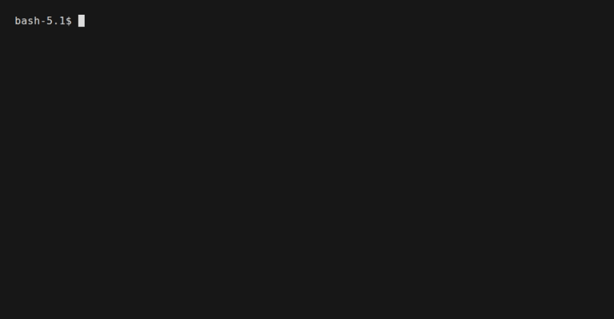

# Graph API (low level)

Every workflow — YAML or `Flow` — compiles down to the same runtime
**`Graph`**: a dictionary of nodes and an explicit list of edges. YAML and the
`Flow` builder are *views* over it; the `Graph` API is the layer underneath
that lets you hand-wire everything when you need full control.

```
YAML ─┐
Flow ─┼─► Graph ──► run() / stream()
```

Reach for the `Graph` API when you want:

- a custom `Node` subclass with imperative logic,
- edges computed at build time (loops over state keys, generated cases),
- hooks, `Command` routing, or `__error__` edges spelled out by hand,
- zero sugar — every node and every arrow visible.

## The shape

A `Graph` is three things: a `nodes` dict, an `edges` list, and an
`entry_point`:

```python
from teff.graph import Edge, Graph
from teff.node import Transform

graph = Graph(
    nodes={
        "count": Transform(action="count_lines", input_key="text", output_key="lines"),
        "single": Transform(
            action="value", value="single-line note", output_key="note"
        ),
        "multi": Transform(action="value", value="multi-line note", output_key="note"),
        "status": Transform(action="value", value="done", output_key="status"),
    },
    edges=[
        Edge("count", "single", "lines=1"),
        Edge("count", "multi", "lines!=1"),
        Edge("single", "status"),
        Edge("multi", "status"),
    ],
    entry_point="count",
)

result = await graph.run(state={"text": "two\nlines"})
print(result["note"])  # multi-line note
```

`run()` starts at `entry_point`, follows every edge whose condition matches
the current state, and shallow-merges each node's output back into the state
dict. `Entry` nodes are runnable: `await graph.run({...})` runs `entry_point`.

The same workflow at both levels — the `Flow` builder vs the hand-wired
`Graph` — then rendered as Mermaid (`hello_workflow` example):

| Flow builder vs Graph API vs rendered graph (`hello_workflow` example) |
| --- |
|  |

## Edges

An `Edge(source_id, target_id, condition=None)` is unconditional by default;
with a condition it routes on the state:

| Condition | Routes when |
| --------- | ----------- |
| `"key=value"` | `state["key"] == value` |
| `"key!=value"` | `state["key"] != value` |
| `"key=a,b"` | `state["key"]` is `a` or `b` (comma = OR) |
| `"key>=N"` / `"key<=N"` / `"key>N"` / `"key<N"` | numeric comparison |
| `callable(state) -> bool` | arbitrary predicate (cannot be serialized) |
| `"__error__"` | the source node raised an exception |

```python
Edge("parse", "retry", "__error__")  # catch failures
Edge("route", "done", lambda s: "ok" in s.get("status", ""))  # arbitrary check
```

## Custom nodes

A node is an `async` function `(ctx, state) -> dict | Command` returning the
state updates to apply. Two ways to make one:

### Function node

```python
from teff.node import Command


async def classify(ctx, state):
    if "bad" in state["text"]:
        return Command(update={"blocked": True}, goto=Command.STOP)
    if "trusted" in state["text"]:
        return Command(update={"cleared": True}, goto="deliver")
    return {"cleared": True}  # fall through to normal edges
```

Build a `Node` from it with `make_function_node`, or subclass `Node`:

```python
from teff.node import Node


class MyNode(Node):
    type = "my_node"

    async def execute(self, ctx, state):
        return {"answer": state.get("text", "")[::-1]}
```

```python
graph = Graph(
    nodes={"my": MyNode()},
    edges=[Edge("my", "end")],
    entry_point="my",
)
```

`goto` in a `Command` may target *any* node id — it does not need an edge —
and `Command.STOP` ends the run. See [Command routing](commands.md).

## Where the abstraction lives

| Concern | YAML / `Flow` | `Graph` API |
| ------- | ------------- | ----------- |
| Declaring nodes | `steps:` / `.step()` | `nodes=` dict |
| Arrows & conditions | `edges:` / `.branch()` / `.route()` | `Edge(..., condition)` list |
| Custom node logic | `@node` decorator | `Node` subclass / function |
| Dynamic routing | `Command` from any node | same — the runtime primitive |
| Serializing to YAML | `flow.to_yaml()` | `graph_to_yaml(graph)` |

The `Graph` API shares one runtime with YAML and `Flow` — a graph built by
hand runs through the same engine, checkpointer, tools and hooks as one loaded
from a file:

```python
from teff.yaml import graph_to_yaml

yaml_text = graph_to_yaml(graph)  # export a hand-wired graph
```

## See also

- [Tutorial](../getting-started/tutorial.md) — the same workflow at all three
  levels (YAML, `Flow`, `Graph`).
- [Choosing your abstraction](choosing-your-abstraction.md) — when to stay at
  each layer.
- [Flow builder](flow-builder.md) — the ergonomic `Flow` surface on top of
  this.
- [`teff.graph`](../api/teff.graph.md) and
  [`teff.graph.Edge`](../api/teff.graph.edge.md) in the API reference.
